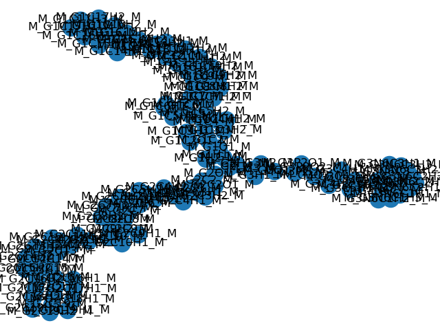
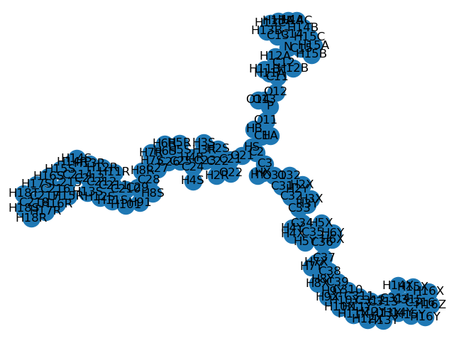

# autoLipMap

autoLipMap is an automatic lipid mapping topology writer from a pdb file containing a single lipid (including all hydrogens). It writes a [mapping file](https://github.com/NMRLipids/MATCH/tree/master/MAPPING) and [def file](https://github.com/NMRLipids/MATCH/tree/master/scripts/orderParm_defs) which are useful for calculating the order parameters from molecular simulations in the [NMRlipids projects](https://nmrlipids.blogspot.com).

A mapping file typically consists of :

```
M_G1_M        C32
M_G1H1_M      H322
M_G1H2_M      H321
M_G1O1_M      O33
[...]
```

The first column contains the **mapping names** for each atom in a lipid. It has been designed to unambiguously refer to each atom in a lipid starting from the 3 carbons in the glycerol (names `M_G1_M`, `M_G2_M` and `M_G1_M`). The second column contains atom names which are found in a pdb structure and are thus force field dependant.

The .def file looks like this :

```
beta1 POPC CD H1D
beta2 POPC CD H2D
alpha1 POPC CE H1E
alpha2 POPC CE H2E
[...]
```

Each line contains the information for a given hydrogen. The first column is the **generic name** of each H in the lipid. The second column is the lipid name. The third column is the pdb name to which the hydrogen is bonded. The fourth column is the pdb name of the hydrogen.

## Requirements

Python >= 3.6 is mandatory for running buildH.

autoLipMap  is written in Python 3 and need the following modules :

- argparse
- pandas
- networkx
- matplotlib

## Usage

```
$ python ./autoLipMap.py -h
usage: autoLipMap.py [-h] -p PDB -l LIPID -op OMAP -od ODEF [--graph]

This program generates a mapping file and a .def file from a pdb file
containing one lipid only.

optional arguments:
  -h, --help            show this help message and exit
  -p PDB, --pdb PDB     pdb file containing a single lipid.
  -l LIPID, --lipid LIPID
                        Name of lipid (e.g. POPC).
  -op OMAP, --omap OMAP
                        Output mapping file name.
  -od ODEF, --odef ODEF
                        Output .def file name.
  --graph               Draw the graphs.
```

The program also needs a file `lipids_info.py` which is used as a module. This latter contains differents lists and dictionnaries for different lipids (so far only POPC is there). It may be changed by the user to add a new lipid.

## Example

```
python ./autoLipMap.py --pdb 1POPC_OK.pdb -l POPC -op automatic_mappingPOPCcharmm36.txt -od automatic_POPCcharmm36.def --graph

```

## Principle

autoLipMap first builds a graph corresponding to a lipid using **mapping names** (this is possible thanks to the info in `lipids_info.py`). Graph nodes are labeled according to the mapping names and correspond to each atom. Graph edges correspond to chemical bonds. Let's call this graph *mapping_graph*. In the following picture you can get an idea of how it looks like:



Difficult to see something, but if we zoom in on the glycerol region it gets clearer:


Then, autoLipMap reads a PDB file with only one lipid (including all hydrogens) and builds a graph of the molecule. Graph nodes are now labeled according to atom names in the pdb and graph edges correspond to chemical bonds. Let's call this graph *pdb_graph*. In the following picture you can get an idea :



Again, if we zoom in on the glycerol region it gets clearer:


Then, using [graph isomorphism](https://en.wikipedia.org/wiki/Graph_isomorphism), autoLipMap can check if the mapping and pdb graphs match and deduce the mapping between mapping names and pdb names.

All graph features and algorithms come from the [networkx module](https://networkx.github.io/).
